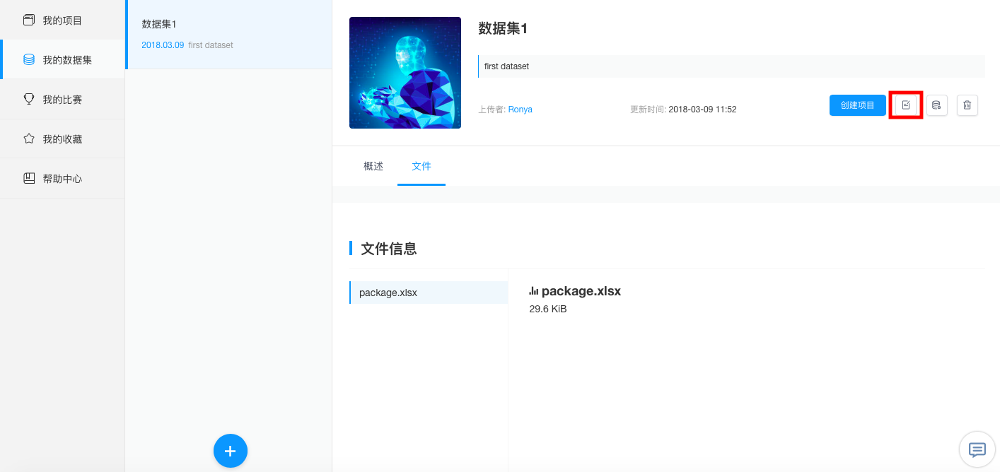

# 数据集

科赛网上的数据集分为**公共数据集**和**私有数据集**两类，公共数据集为科赛网管理员整理并创建的数据集，可供全体用户访问并使用；私有数据集为科赛网用户上传的数据集，**仅供上传者访问并使用**。

## 创建数据集
在`K-Lab页面`下的`我的数据集`中点击蓝色`+`或直接点击`创建数据集`来进行数据集的创建。

* 填写数据集名称：用户对将要上传数据集的命名
* 设置挂载目录：挂载目录为可以在K-Lab Notebook中访问到数据集的地址，挂载目录的设置支持字母、数字及下划线，**在创建后不可修改**。比如，以上传名为package.xlsx的数据文件为例，计划把它挂载于目录first_dataset下，那么，在挂载目录中填入```first_dataset```即可。

* 添加文件：K-Lab支持用户在一个数据集目录下面上传不超过20个文件(如csv,json,txt,xlsx)，**并且这些文件总大小不得超过100M**。
* 数据集信息：进行数据集封面图片，数据集名称，短描述的编辑。
* 数据集文档和文件信息。

## 挂载数据集
详见[数据分析项目](chapter5.md)中有关**[创建项目](chapter5.md#创建项目)**的内容。

## 管理数据集
用户可以通过`K-Lab页面`和`数据集页面`进入`我的数据集`，访问当前已经创建好的数据集，并可以在数据集下直接选择**创建项目**，或完成对**数据集信息**和**数据集文件**的修改，以及**删除当前数据集**等操作。
* 创建项目：用户可以利用上传的数据集新建项目。
 
* 编辑属性：
 
  * 修改数据集信息：用户可以对数据集的名称、短描述进行修改，编写数据集文档，并对csv类型的数据集文件做标注。
  * 修改数据集文件：用户可以对数据集文件做修改，如上传新文件、删除旧文件。


* 删除数据集：用户个人上传的数据集一经删除，无法找回。
  
