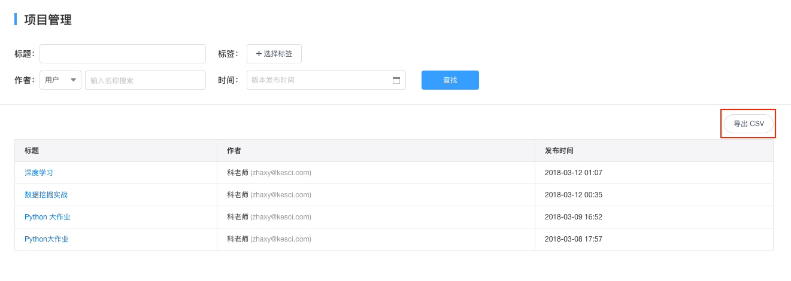
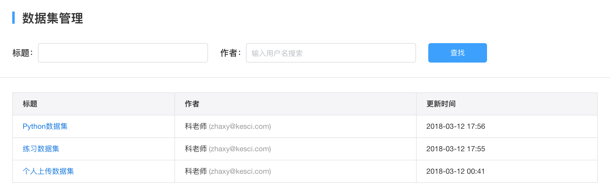

# 组织管理
组织成员分为普通成员和管理员。组织管理员拥有对组织进行**内容管理**，**标签管理**，**成员管理**以及**编辑组织信息**的权限。

##内容管理
内容管理包括**数据集**和**项目**，管理员可以在内容管理页面下对数据集或项目进行批量筛选及审阅。
 

##数据集管理
在数据集管理页面，管理员可以查看到组织内用户上传的**所有**数据集。并且可以通过搜索**标题**或数据集**作者**查找相关数据集。
* 标题搜索：通过搜索数据集标题内包含的关键字查找数据集。
 
