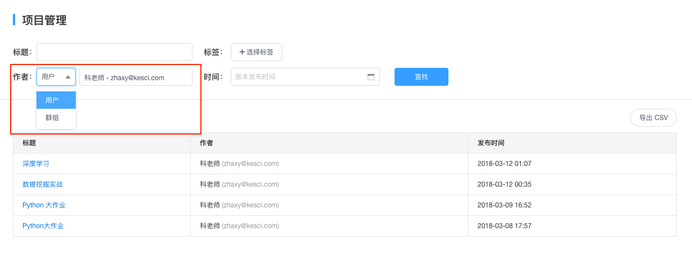

# 组织管理
组织成员分为普通成员和管理员。组织管理员拥有对组织进行**内容管理**，**标签管理**，**成员管理**以及**编辑组织信息**的权限。

## 内容管理
内容管理包括**数据集**和**项目**，管理员可以在内容管理页面下对数据集或项目进行批量筛选及审阅。

### 数据集管理
在数据集管理页面，管理员可以查看到组织内用户上传的**所有**数据集。并且可以通过搜索**标题**或数据集**作者**查找相关数据集。
* 标题搜索：通过搜索数据集标题内包含的关键字查找数据集。
 
 
* 作者搜索：输入用户名进行搜索，或在下拉菜单选择用户名。
 
 
### 项目管理
在项目管理页面，管理员可查看到组织内**所有**的数据分析项目，并且可以通过**标题**，**标签**，**作者**和**时间**对项目进行批量筛选。项目筛选出的结果可以导出生成csv文件。
 
* 标题搜索：输入标题关键字搜索数据分析项目。

* 标签筛选：通过选择标签筛选出含有该标签的数据分析项目。

* 作者筛选：通过选择创建项目的用户或群组进行项目筛选。

* 时间筛选：选定一个时间段，筛选出在该时间段内项目发布的最新版本。

## 标签管理
标签是用来给内容进行分类的一种方法，K-lab组织版给用户提供了一个有层级的标签体系，一般由管理员创建标签。管理员可以自定义标签的层级和每一层级的标签数量。在K-lab组织版里，管理员可以根据自己组织不同的需求自由创建标签体系，并在`标签管理`页对标签进行增、删、改。
* 创建标签：在标签管理页，点击`创建标签` 按钮，在弹窗内输入标签名称，并在下拉菜单中选择该标签的父标签。父标签即标签的上一级标签。如父标签选择无，则该标签为一级标签。标签的层级不限。

* 创建子标签：也可以点击`+`按钮，直接在某一标签下直接创建其子标签。
* 修改标签：点击`修改`按钮，可在弹窗中修改标签名称或修改其父标签。
* 删除标签：点击`删除`按钮，若标签下有子标签，则其相关子标签也会被删除。

## 人员管理

### 成员
`成员页面`显示了组织内所有成员列表，可以看到现有成员的用户名，邮箱地址及所属群组。管理员在此页邀请新成员加入组织。

* 邀请成员：点击`邀请成员`按钮，进入邮件邀请页面。管理员可以添加多个邮箱地址，**以行分隔**，**进行批量邀请**。在邀请成员时即可为成员分配群组。点击`发送邀请`按钮，邀请将以邮件形式发送。

* 查看待接受邀请成员：管理员可以通过下拉菜单切换至**待接受邀请列表**，查看尚未接受邀请加入组织的成员。

* 搜索成员：可在搜索框内输入成员的用户名，搜索成员。

### 群组
群组页面显示所有群组的列表，有**群组名**，**人数**，**创建时间**和**相关操作**。群组在K-lab组织版里，管理员可以根据需求创建不同的群组，对组织成员进行分类。在邀请成员加入组织后，即可给他们分配群组。

* 创建群组：点击`创建群组`按钮，在弹窗中输入群组名称，不超过20个字符。

* 修改群组名：点击`修改`按钮，可以在跳出的弹窗里修改群组名。

* 搜索群组：可以通过群组名称里的关键词搜索群组。
* 添加及删除群组成员：点击群组名，进入群组信息页。点击`添加成员`按钮，在弹窗中勾选需要添加的成员，将成员添加至该群组。点击`删除`按钮，即可将成员从群组中删除，但成员仍在组织中。

## 组织信息
在组织信息页，可以查看并修改组织**Logo**，**名称**，和**组织简介**。组织URL只能查看不可修改。

